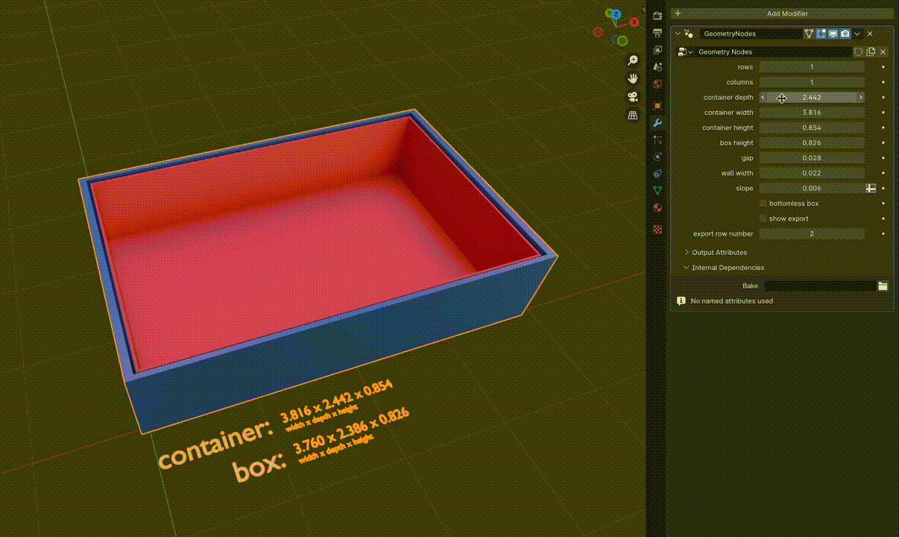

# drawer inserts

This is a [blender](https://www.blender.org/) project for procedurally generating 3D printable drawer inserts.  
Blender v4.0.2 was used to create it.

It is inspired by [this project](https://github.com/node-dojo/dojo-recursive-bins) from @node-dojo.

## Demo

Here is a short GIF of the tool in action:

☝️ this but as a [video with higher quality](media/procedurally-generated-drawer-inserts.mp4).

## Usage

Download and install Blender if you haven't already. Then, open the `drawer-inserts.blend` file. You will see a 3D view displaying the drawer inserts on the left and the configuration options on the right. The configuration options include:

| option              | type      | description                                              |
| ------------------- | --------- | -------------------------------------------------------- |
| `rows`              | `integer` | Number of rows in the drawer                             |
| `columns`           | `integer` | Number of columns in the drawer                          |
| `container depth`   | `float`   | Depth of the drawer                                      |
| `container width`   | `float`   | Width of the drawer                                      |
| `container height`  | `float`   | Height of the drawer                                     |
| `box height`        | `float`   | Height of the inserts                                    |
| `gap`               | `float`   | Gap between insert                                       |
| `wall width`        | `float`   | Thickness of insert walls                                |
| `slope`             | `float`   | Slope of the inserts                                     |
| `bottomless box`    | `bool`    | Indicates whether inserts have a bottom                  |
| `show export`       | `bool`    | Toggle showing just one insert for export to e.g. `.stl` |
| `export row number` | `integer` | Row number of the insert to export                       |

### Hints:

- Bottomless inserts are much quicker to print, at least with FDM printers.
- Adding a slope is useful for drawers closer to eye level or ones that do not pull out all the way. Helps to see and grab the content.
- Units are omitted on purpose. As long as your ratio is correct, you can use any unit you like and later scale the model in a slicing software of your choice.
- Exporting a single insert can be done by setting `show export` to `True` and `export row number` to the row number of the insert you want to export. Export to `.stl` by navigating to `File > Export > Stl (.stl)`.
